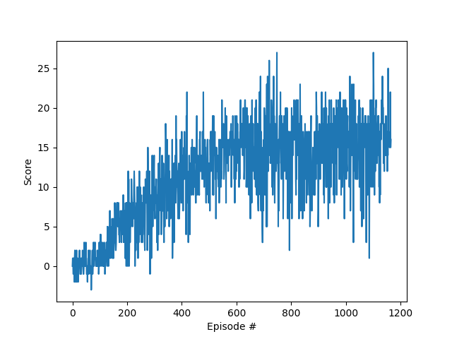

[//]: # (Image References)

[image1]: https://user-images.githubusercontent.com/10624937/42135619-d90f2f28-7d12-11e8-8823-82b970a54d7e.gif "Trained Agent"

# Project 1: Navigation

### Introduction

For this project, I trained an agent to navigate (and collect bananas!) in a large, square world.

![Trained Agent][image1]

A reward of +1 is provided for collecting a yellow banana, and a reward of -1 is provided for collecting a blue banana.
Thus, the goal of my agent was to collect as many yellow bananas as possible while avoiding blue bananas.

The state space has 37 dimensions and contains the agent's velocity, along with ray-based perception of objects around agent's forward direction.  Given this information, the agent has to learn how to best select actions.  Four discrete actions are available, corresponding to:

- **0** move forward.
- **1** move backward.
- **2** turn left.
- **3** turn right.

The task is episodic.
The agent must get an average score of +13 over 100 consecutive episodes to solve the task.

### Getting Started

1. Download the environment from one of the links below.  You need only select the environment that matches your operating system:
    - Linux: [click here](https://s3-us-west-1.amazonaws.com/udacity-drlnd/P1/Banana/Banana_Linux.zip)
    - Mac OSX: [click here](https://s3-us-west-1.amazonaws.com/udacity-drlnd/P1/Banana/Banana.app.zip)
    - Windows (32-bit): [click here](https://s3-us-west-1.amazonaws.com/udacity-drlnd/P1/Banana/Banana_Windows_x86.zip)
    - Windows (64-bit): [click here](https://s3-us-west-1.amazonaws.com/udacity-drlnd/P1/Banana/Banana_Windows_x86_64.zip)

    (_For Windows users_) Check out [this link](https://support.microsoft.com/en-us/help/827218/how-to-determine-whether-a-computer-is-running-a-32-bit-version-or-64) if you need help with determining if your computer is running a 32-bit version or 64-bit version of the Windows operating system.

    (_For AWS_) If you'd like to train the agent on AWS (and have not [enabled a virtual screen](https://github.com/Unity-Technologies/ml-agents/blob/master/docs/Training-on-Amazon-Web-Service.md)), then please use [this link](https://s3-us-west-1.amazonaws.com/udacity-drlnd/P1/Banana/Banana_Linux_NoVis.zip) to obtain the environment.

2. Place the file in the DRLND GitHub repository, in the `p1_navigation/` folder, and unzip (or decompress) the file.

n.b. this package uses pytest and cuda mixed precision.

Please ensure your environment has both the following libraries loaded , or you can load the provided condaenv below
- pytest
- pytorch pytorchvision cudatoolkit

### Neural Network Architecture

The agent internally uses  a pytorch neural network to represent the qtable #
The network consists of a layer representing the 37 states of the environment, a 32 node and 16  fully connected middle layer
and an output layer consisting of 4 nodes for each of the output action.

The two middle layers use rectified linear activation (relu)
and the agent select an argmax of the output actiokns stochastically via the eps or a random action.

### Hyper Parameters
The system uses the following hyper paramters
```
 BUFFER_SIZE = int(1e5)  # replay buffer size
 BATCH_SIZE = 64  # minibatch size
 GAMMA = 0.99  # discount factor
 TAU = 1e-3  # for soft update of target parameters
 LR = 5e-4  # learning rate
 UPDATE_EVERY = 4  # how often to update the network
```

### Training Algorithm
The system periodically fills the buffer with experiences, it uses the data gained to train the internal neural network q-table  with action values.
The loss function is calculated from the agents internal q-table and uses the previous expriences collected in the buffer as training data.
The system also uses the q-table for inference

### Plot of the Scores
The system records the culmulative score for each episode and plots the scores over time.
An image of the plot can be seen here


### Instructions

3. (Optional) there is a conda environment included, that enables the code to run against cuda 11 and pytorch 1.7
you may load the conda environment the following way
``` conda activate ./condaenv/p1_navigation```

4. Running the tests
In order to help organise the different ways for the execution environment to run, the system is split into different tests that configure the system in different ways before

#### Train and Agent from scratch , print the scores and save the model weights to *navigation_checkpoint.pth*
```pytest  tests/test_Navigation.py::test_learning_agent_no_graphics```

The system reports the scores similar to this

> Episode 100     Average Score: 0.35
>
> Episode 200     Average Score: 3.71
>
> Episode 300     Average Score: 6.96
>
> Episode 400     Average Score: 9.48
>
> Episode 500     Average Score: 12.18
>
> Environment solved in 451 episodes!     Average Score: 13.04


#### Watch the Agent Train from scratch , print the scores and save the model weights to *navigation_checkpoint.pth*
```pytest  tests/test_Navigation.py::test_learning_agent_no_graphics```

#### Load Agent Weights from the file and  The Learned Agent Navigate the Environment
```pytest  tests/test_Navigation.py::test_watch_learned_agent```
I set eps to its minimal value as we want the agent to rely more on its experience than exploration.
